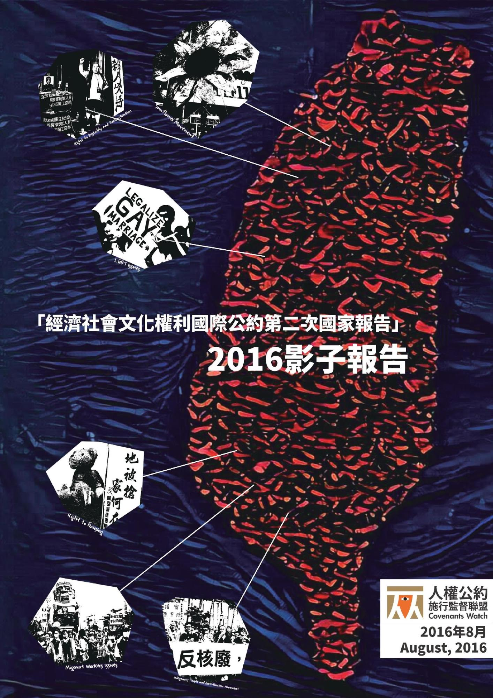

# 「經濟、社會、文化權利國際公約第二次國家報告」2016影子報告

**人權公約施行監督聯盟**

**2016年8月**

## 關於本報告

這份影子報告是針對台灣政府在2016年3月1日發佈的《經濟、社會、文化權利國際公約第二次國家報告》而作。出版影子報告有兩方面的理由，首先，是為了補充第二次國家報告，以利於2017年1月由獨立國際專家進行之審查；其次，也對公民團體與政府在2013年至2016年間，在人權議題上意見分歧處做出總結。

這份報告由人權公約施行監督聯盟與作為合作平台，在多位責任編輯的努力下，由79個民間團體（參見後方「本報告協作團體」名單）數十位作者共同撰寫而成。這份報告的產出及其英文譯本若沒有318反服貿公民運動（由經濟民主連合協助）、台灣民主基金會、台北律師公會提供翻譯經費，台灣廢除死刑推動聯盟提供印刷經費，以及來自眾多個人捐款者對人權公約施行監督聯盟的支持，將無法付梓成冊。

## 召集人 Convener

* 黃嵩立 人權公約施行監督聯盟 Song-Lih Huang, Covenants Watch

## 執行編輯 Editors

* 施逸翔 台灣人權促進會 Yi-Hsiang Shih, Taiwan Association for Human Rights
* 黃怡碧 人權公約施行監督聯盟 Yibee Huang, Covenants Watch
* 韓宜臻 人權公約施行監督聯盟 Yichen Hang, Covenants Watch

## 責任編輯群 Associated Editors (in alphabetical order)

* 張烽益 台灣勞工陣線 Chang, Feng-Yi, Taiwan Labor Front
* 陳惠敏 監所關注小組 Chen, Huimin, Prison Watch
* 周宇修 民間司法改革基金會 Chou, Clarence, Judicial Reform Foundation
* 韓宜臻 人權公約施行監督聯盟 Hang, Yichen, Covenants Watch
* 何明諠 台灣人權促進會 He, Ming-Hsuan, Taiwan Association for Human Rights
* 徐亦甫 反迫遷連線 Hsu, I-Fu, Taiwan Alliance of Anti-Forced Eviction
* 許仁碩 台灣人權促進會 Hsu, Jen-Shuo, Taiwan Association for Human Rights
* 黃怡碧 台灣國際醫學聯盟 Huang, Yibee, Taiwan International Medical Alliance
* 洪敬舒 公平稅改聯盟 Hung, Sue, Fairtax Taiwan
* 高蓁誼 反迫遷連線 Kao, Chen-Yi, Taiwan Alliance of Anti-Forced Eviction
* 梁組盈 南洋台灣姊妹會 Liang, Tsu-Ying, TransAsia Sisters Association, Taiwan
* 林欣怡 台灣廢除死刑推動聯盟 Lin, Hsinyi, Taiwan Alliance to End the Death Penalty
* 林彥彤 反迫遷連線 Lin, Yen-Yung, Taiwan Alliance of Anti-Forced Eviction
* 蘇慶軒 台灣真相與和解促進會 Su, Ching-Hsuan, Taiwan Association for Truth and Reconciliation
* 洪簡廷卉 LIMA台灣原住民青年團 Tuhi Martukaw, LIMA Taiwan Indigenous Youth Working Group
* 吳政哲 台灣少年權益與福利促進聯盟 Wu, Cheng-Che, Taiwan Alliance for Advancement of Youth Rights and Welfare
* 顏詩怡 婦女權益促進發展基金會 Yen, Shi-Yi, Foundation of Women's Rights Promotion and Development
* 葉虹靈 台灣真相與和解促進會 Yeh, Hung-Ling, Taiwan Association for Truth and Reconciliation

## 本報告協作團體 Contributing Authors’ Affiliations

* 台灣原住民族政策協會 Association for Taiwan Indigenous Peoples' Policies
* 婦女新知基金會 Awakening Foundation
* 民間公民與法治教育基金會 Civic and Law-Related Education Foundation
* 人權公約施行監督聯盟 Covenants Watch
* 中華民國儲蓄互助協會 Credit Union League of the Republic of China
* 中國合作學社 China Cooperation Cooperative Societies
* 社團法人臺灣兒童權益聯盟 Children’s Rights Alliance Taiwan
* 公民參與媒體改造聯盟平台 Citizen Media Watch
* 公民同志平權推動聯合會 Civic LGBT Equal Rights Association
* 經濟民主連合 Economic Democracy Union
* 環境法律人協會 Environmental Jurists Association
* 萬國法律事務所 Formosa Transnational
* 反大湖重劃自救會 Guishan Dahu Self-help Association
* 校園同志甦醒日 Gay & Lesbian Awakening Days
* 好蟾蜍工作室 Good Toad Studio
* 龜山反大湖重劃自救會 Guishan Self-help Association against Dahu Land Consolidation
* 華光社區訪調小組 Huaguang Community Concerned Group
* 世新大學社會發展研究所遊民
* 工作坊 Homeless Workshop of Graduate Institute for Social Transformation Studies
* 台灣性別不明關懷協會 Intersex, Transgender and Transsexual People Care Association
* 民間司法改革基金會 Judicial Reform Foundation
* 靖娟基金會 Jing Chuan Child Safety Foundation
* LIMA台灣原住民青年團 LIMA Taiwan Indigenous Youth Working Group
* 樂生保留自救會暨樂生青年聯盟 Losheng Self-Help Association and Youth Alliance for Losheng
* 原住民族青年陣線 Indigenous Youth Front
* 中華心理衛生協會 Mental Health Association in Taiwan
* 南澳青年聯盟 Mklesan Tayal Youth Union
* 沒有名字的人 Nameless Indigenous
* 台灣婦女團體全國聯合會 National Alliance of Taiwan Women's Associations
* 台北大學翻牆社 NTPU CROSS
* 臺大學生會性別工作坊 NTU Gender Studio
* 紹興學程 NTU Student Activist Group Shaoxing Program
* 中華民國愛滋感染者權益促進會 Persons with HIV/AIDS Rights Advocacy Association of Taiwan
* 監所關注小組 Prison Watch
* RCA自救會 RCA Self-Help Association
* 撒烏瓦知部落 Saowac Community
* 社會住宅推動聯盟 Social Housing Advocacy Consortium
* 南鐵居住正義青年小組 Southern Railway Youth
* 反迫遷連線 Taiwan Alliance of Anti-Forced Eviction
* 廢除死刑推動聯盟 Taiwan Alliance to End the Death Penalty
* 台灣伴侶權益推動聯盟 Taiwan Alliance to Promote Civil Partnership Rights
* 都市更新受害者聯盟 Taiwan Alliance for Victims of Urban Renewal
* 台灣少年權益與福利促進聯盟 Taiwan Alliance for Advancement of Youth Rights and Welfare
* 集遊惡法修法聯盟 Taiwan Alliance for Rights of Assembly and Parade
* 台灣人權促進會 Taiwan Association for Human Rights
* 台灣真相與和解促進會 Taiwan Association for Truth and Reconciliation
* 冤獄平反協會 Taiwan Association for Innocence
* 台灣防暴聯盟 Taiwan Coalition Against Violence
* 台灣性別平等教育協會 Taiwan Gender Equity Education Association
* 台灣國際醫學聯盟 Taiwan International Medical Alliance
* 台灣國際勞工協會 Taiwan International Workers’ Association
* 台灣勞工陣線 Taiwan Labor Front
* 台灣勞動與社會政策研究協會 Taiwan Labor and Social Policy Research Association
* 台灣農村陣線 Taiwan Rural Front
* 社團法人台灣同志諮詢熱線協會 Taiwan Tongzhi (LGBT) Hotline Association
* 台灣女人連線 Taiwan Women's Link
* 台灣警察工作權益推動協會 Taiwan Police Union
* 台北市婦女救援基金會 Taipei Women’s Rescue Foundation
* 台南市性別平等促進會 Tainan Association for the Promotion of Gender Equality
* 台灣職業安全健康連線 Taiwan Occupational Safety and Health Link
* 罕見疾病基金會 Taiwan Foundation for Rare Disorder
* 台灣障礙者權益促進會 Taiwan Association for Disability Rights
* 台灣健康行動人權協會 Taiwan Health Right Initiative
* 台灣酷兒權益推動聯盟 Taiwan Gender Queer Rights Advocacy Alliance
* 工作傷害受害人協會 Taiwan Association for Victims of Occupational Injuries
* 中華民國律師公會全國聯合會 Taiwan Bar Association
* 台北律師公會人權委員會 Taipei Bar Association
* 永社 Taiwan Forever Association
* 桃園航空城反迫遷聯盟 Taoyuan Aeropolis Anti-Eviction Alliance
* 勵馨社會福利事業基金會 The Garden of Hope Foundation
* 中華民國身心障礙聯盟 The League for Persons with Disabilities, R.O.C.
* 全國教師工會聯合會 The National Federation of Teachers Unions
* 南洋台灣姊妹會 TransAsia Sisters Association, Taiwan
* 淡海二期反徵收自救聯盟 Tamhai Phase II Alliance of Self-Help Groups for Anti-Expropriation
* 天主教會新竹教區越南外勞配偶
* 辦公室 Vietnamese Migrant Workers and Brides Office
* 台灣蠻野心足生態協會 Wild at Heart Legal Defense Association, Taiwan
* 當代漂泊協會 Working Poor Unite
* 工作貧窮與租稅政策研究室 Working poor & Tax Policy Research Center
* 塭仔圳反迫遷連線 Wen Zi Zhen Anti-Eviction Alliance
* 苑里反瘋車自救會 Yuanli Self-Help Group

## 授權條款

## 相關資源

* [PDF](pdf/2016經社文公約施行影子報告.pdf)
* [Gitbook](https://www.gitbook.com/book/jrf-tw/taiwan-icescr-shadow-report-2016-zh-tw/)
