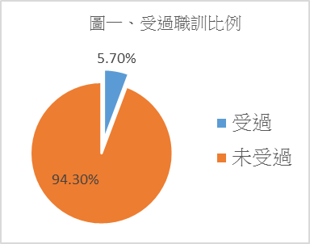
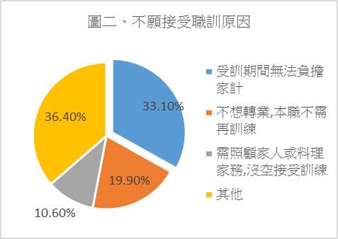

## 第九條

### 社會保障社會保障制度

<ol start="138">
  <li>
回應經社文初次國家報告第121和137段，《社會救助法》第15條明訂「直轄市、縣（市）主管機關應依需求提供或轉介低收入戶及中低收入戶中有工作能力者相關就業服務、職業訓練或以工代賑。」但是中央及地方政府基於財政及員額限制，在就業服務部分大量導入派遣人員用以協助弱勢者就業。根據2013年監察院調查報告，當時勞委會（勞動部前身）職員預算員額為1672人，派遣勞工為1829人，派遣勞工與職員預算員高達1.09：1占各部會之冠，且派遣人力多分布在各處就業服務站，形成「非典弱勢協助經濟弱勢求職」，無助就業服務品質提升。
</li>

  <li>
根據2013年低收及中低收入戶生活調查，低收入戶及中低收入戶家計負責人具工作能力且受過職業訓練者僅占5.7%，未受過訓練者達 94.3%（圖一）。其中，經濟弱勢者不願意接受職訓的原因，以「受訓期間無法負擔家庭生計」33.1%最高、「不想轉業，本職不需再訓練」19.9%次之，至於「需照顧家人或料理家務，沒空接受訓練」則為10.6%（圖 一）。顯示現行法令雖要求對經濟弱勢者提供就業支持，給付訓練津貼卻偏低難以因應受訓期間生活需求，以致受訓比例明顯偏低。此外，法令要求各直轄巿、縣巿辦理職業訓練，但除財源能力較佳者外，絕大多數縣巿無力開設職訓課程，只能轉為委外訓練，但各私立訓練機構課程高度重疊，也僅協助受訓者取得證照，造成我國證照氾濫卻不易就業的怪現象，以2014年勞動部統計為例，當年技能檢定合格發證數高達43萬3212張，其中僅中餐葷食烹飪便高達40,168張，占9.27%；至於網頁設計也發出12,508張。在低收及中低收入調查中也出現同樣結果，願接受職訓的經濟弱勢戶，選擇課程以「餐飲服務」高達29%、「電腦、資訊」也達25%，顯示當經濟弱勢的受訓者大量擠進相同課程後，反而造成技能相近的競爭關係，無力針對弱勢者提供個別化服務的職訓政策根本難以協助脫貧。

    <figure>
      
      <figcaption>圖二 ICESCR 9.1：受過職訓比例</figcaption>
    </figure>

    <figure>
      
      <figcaption>圖三 ICESCR 9.2：不願接受職訓原因</figcaption>
    </figure>

  </li>

  <li>
因此，我們建議：全面翻修現行《職業訓練法》，納入未來產業發展人力需求規劃，並以此規劃職業使其朝向多樣化，對企業提供訓練且僱用應提供獎勵；而貧困者參與職訓期間也應適度提高訓練津貼，提高參與訓練誘因。
</li>
</ol>

### 社會福利預算

<ol start="141">
  <li>
回應國家報告第111段，總體社會福利預算增加，主要是提高現金付給所導致。台灣長期各黨為爭取選票支持大舉提出各種現金給付政策，造成社會福利幾乎只有發錢一途。根據2012年媒體報導，前內政部官員坦承當年社福預算中現金給付就占約94%37，與此同時中央及地方政府的財政赤字也出現飆升。2007年中央及地方政府總債務為4.29兆元，但2016年已增加至6.36兆元，10年間增幅達148%（圖三），且社會福利預算，顯示社會福利支出增加實是政治人物為求勝選，不惜以挪用後代子孫財源的舉債，擴張社會福利。諸多研究警告，現金給付可能會無意間排除最需要的人如家戶中的兒童及婦女，過度依賴現金給付將造成社會福利政策難以提供更多服務模式，資源排擠之下服務品質亦不穩定，並造成家庭領取現金後可能迫使婦女脫離職場獨撐家務，導致台灣中高齡女性勞參率偏低（圖六）。

    <figure>
      
      <figcaption>圖五 ICESCR 9.3：各級政府債務（單位：億元）</figcaption>
    </figure>

    <figure>
      
      <figcaption>圖六 ICESCR 9.4：2015年勞動參與率</figcaption>
    </figure>

  </li>

  <li>
因此，我們建議：社會福利事項應回歸中央辦理，並檢視社福預算支用合理性，削減不必要的買單福利政策，例如65歲老人免費假牙、70歲以上健保免費，避免地方選舉浮濫開立福利支票卻債留子孫，並確保福利資格與提供的一致性。現金給付比例可分十年逐年降低至OECD28國家平均65%左右的水平，並將現金給付財源轉為服務提供，協助開辦長期照護及托嬰托育等公共服務，除降低財政壓力外，亦可創造更多元的服務就業機會。
</li>
</ol>

### 社會救助與津貼

<ol start="143">
  <li>
回應國家報告第113段，《社會救助法》第 5-1 條第二項「明訂有工作能力未就業者，依基本工資核算。但經公立就業服務機構認定失業者或五十五歲以上經公立就業服務機構媒介工作三次以上未媒合成功、參加政府主辦或委辦全日制職業訓練，其失業或參加職業訓練期間得不計算工作收入，所領取之失業給付或職業訓練生活津貼，仍應併入其他收入計算。」
</li>

  <li>
該立法目的在防止福利依賴，卻造成長期失業無收入者被設算基本工資所得（2015年為20008元），已超出各縣巿最低生活費標準，而被排除在救助體系之外；雖同法納入「認定失業者可不計算工作收入」，但我國失業給付領取期限為6個月，特殊情況如中高齡或特境家庭可延至9個月，所以領完失業給付後就算仍未就業，也無法獲得救助支持。當前我國長期失業人數（即失業期超過一年者）日愈增加，2015年已增加至7.2萬人，失業期在6個月至一年間人數也有6萬人，兩者合計占總失業人口達31.4%，未能符合社會救助資格的眾多失業者，形同救助體系的孤兒。
</li>

  <li>
當前《失業保險法》明訂可領取失業給付必須是非志願性失業，即遭公司資遣者，實務上許多遭雇主逼迫而離職的勞工多歸類為志願離職，導致失去失業給付資格同時，又因為被社會救助設算所得，而喪失救助資格。
</li>

  <li>
當前社會救助基準以可支配所得中位數計算，而可支配所得資料是以二階抽樣約2萬份問卷調查，本身容易失真；先進國家均以財稅所得資料為計算基礎，但我國諸多資本所得並無課徵法源，如證券交易所得、期貨交易所得，或是課徵稅額偏低，如土地增值稅或房地交易所得，以至個人財稅資料亦與實際所得落差極大，或者因從事地下經濟，如攤販，以致社會救助之基準與家戶所得均無法依實質所得衡量，一旦申請者有意利用人頭隱匿所得，相關單位無力查核，反形成社會救助的逆分配。
</li>

  <li>
因此，我們建議：取消設算所得制度，回歸以家戶或個人資產狀況調查評估救助資格。政府應透過稅制改革，將各項資本利得納入強制申報範圍，並視國家財政狀況課徵合理稅收。同時也應落實攤販月營業額20萬以下應開立發票的法規，使家戶及個人所得掌握更為完整，避免救助體系出現逆分配。
</li>
</ol>

### 國民年金保險

<ol start="148">
  <li>
回應國家報告第129段、130段，2008年才立法實施的國民年金保險（以下簡稱「國保」），是在台灣以職業別社會保險分類架構下，將無任何職業者強制加入組成「無職業者保險」，形成「弱弱互保」的現象，而無職業者繳費能力低弱，造成「國保」收繳率逐年下滑到了47%，這註定了「國保」未來財務將有很大危機。而國民年金保險被保險人主要是無職業的家庭主婦。因此，如果因沒有能力繳費，而喪失國民基本老年生活保障，將有違經社文公約第九條規定。
</li>

  <li>
另由於，勞工保險的內容比國民年金優厚，年金年所得替代率，「國保」為1.3%，勞保為1.55%，且勞保投保薪資可以變動，「國保」則是固定薪資，目前低於勞保最低投保薪資，而過去許多家庭主婦透過職業工會的加入勞保，由於職業工會審核資格寬鬆，因此2008年9月開始強制實施國民年金之後，許多家庭主婦轉而投入職業工會加保，從2008年底的237萬人，到了2011年底增加到了255萬人。這種「國保」與勞保職業工會之間的競爭關係，也造成「國保」繳費率低於五成，進而加劇財務危機。
</li>
</ol>

### 農民健康保險

<ol start="150">
  <li>
1989年開始實施的《農民健康保險條例》（以下簡稱「農保」），在1995年全民健保開辦後時，醫療部分被整併，僅留有生育、殘廢、死亡等一次給付，因此其實與健康保險毫無關係。
</li>

  <li>
「農保」開辦起，由於費率偏低，目前為2.55%，投保薪資固定為11100元，每人僅負擔78元，財務惡化持續累積虧損，政府以預算撥補總計達到約1500億元。「農保」根本是「名為社會保險，實為福利津貼」的制度。
</li>

  <li>
目前加入「農保」者，主要誘因是因為「農保」資格可以成為《老年農民福利津貼暫行條例》當中老農津貼的發放資格依據，依據該條例2015年的最新修法必須參加「農保」十五年以上，方能於65 歲之後，每月領取7000元，未達十五年只能領取3500元．過去只要加保六個月就能領取7000元，造成許多弊端，因此修法後更加嚴格．
</li>

  <li>
本來「農保」必須為擁有0.25公頃農地自耕農方能加保，但在2015的修法中降低為自耕農0.1公頃、承租農地者0.2公頃方能加保，但鄉間農地主多以口頭不以書面契約承租．因此，「農保」已經成為保障農地主，實際從事農耕者反而無法得到保障．這形成目前許多青年到農村耕作卻無法享有勞保的矛盾現象。
</li>
</ol>

### 勞工保險與退休

<ol start="154">
  <li>
回應國家報告第134段，職業災害保險為勞工保險的一部分，受限於勞工保險未強制人人納保，因此不是每個勞工都能獲得職業災害的保障，以致仍有100多萬勞工未受保障，無法取得任何職災保險給付。
</li>

  <li>
回應國家報告第134段，目前受僱於四人以下事業單位的勞工，並沒有強制雇主加入勞保，造成這些勞工必須自行以三倍保費以職業工會身分加入勞保，形成同樣都是受僱勞工，卻不公平的對待。
</li>

  <li>
勞工保險的老年保障，過去長期僅以一次給付，一直到2009年開始才實施老年年金給付，退休保障不足的現象才有所改善。不過根據政府財務精算推估，由於台灣高齡化、少子女化的人口因素，形成年金給付的龐大壓力，勞保將於2027年破產，雖然，勞保已經逐年將年金給付資格提高到65歲，費率逐漸提高12%，但是財務負擔還是非常沉重，因此如何讓勞保永續發展，將是未來的一大挑戰。
</li>

  <li>
原來《勞基法》專屬單一企業的確定給付之勞退舊制，自2005年開始改為確定提撥個人帳戶之勞退新制，企業每月將薪資6%提撥進入勞工個人帳戶。該基金已經累積金額高達1.5兆元，原來為有任期制的勞退監理會負責管理，2014年改由勞動部下屬之勞動基金運用局負責，導致這龐大基金常淪為非專業性政治護盤工具。
</li>

  <li>
參照原住民族專章第9段至13段，有關原住民族長期照顧之社會權與文化權受侵害。
</li>
</ol>

### 就業保險

<ol start="159">
  <li>
回應國家報告第9條第148-150段，有關就業保險的議題。國家報告應說明為什麼依《就業服務法》規定請領育嬰留職停薪者，任職於服務單位規模30人以上（佔51%）多過服務單位規模30人（佔41%）以下。
</li>

  <li>
從2009年開始發放的育嬰留職停薪津貼，其給付金額卻超乎勞動部預期地急遽上升。修法當時，勞動部樂觀地認為，女性勞工申請育嬰留職停薪津貼的最大值，一年給付絕對不會超過40.5億元，即使同時其配偶男性在妻子領完六個月之後，也都也全數來申請另一個六個月的津貼，那極限將是81億元，基金也應足夠。不過，官方當時估計絕對不會出現的最大值，即將在今年出現，因為到2015年7月為止，育嬰留職停薪津貼已經發放了48.9億元，推估全年將超過90億元。
</li>

  <li>
不過，從2009年起至今2015年，這5年多來，育嬰留職停薪津貼的給付金額成長約3.7倍，從2009的17.2億元，暴增到2014年的63.8億元，首度超越了當年度失業給付的63.5億元，育嬰留職停薪津貼的給付金額佔「就保基金」給付總額的比例為42.7%，也是首度超越失業給付的42.5%。而到了2015年7月，育嬰留職停薪津貼更已經累計發放達48.9億，佔了「就業保險」給付總額的49.4%，對照當月失業給付37.7億佔37.7%，可看出，兩者的比率差距持續擴大。
</li>

  <li>
也就是說，就業保險當中的失業給付、提早就業獎助津貼、職業訓練生活津貼、育嬰留職停薪津貼等四大給付項目，育嬰留職停薪津貼已經佔了接近一半的給付金額，此趨勢若放任其發展，這對於就業保險的設立立法宗旨，作為「因應未來失業並紓緩失業者經濟中斷與提供就業服務」的功能，恐將大打折扣，也喪失就業保險制度設計之原意。
</li>

  <li>
育嬰留職停薪津貼給付金額日益攀升，且固定超過就業保險給付的半數的現象，將可能降低就業保險對失業者保障的能動性，必須嚴格加以重視。而且育嬰留職停薪津貼與就業服務機構幾乎毫無關係，單純勞保局直接發放的現金給付，相較就業保險中「失業給付」、「職訓津貼」與就業服務體系等密切相連的關係大大不同。
</li>

  <li>
正本清源之道，實應當將育嬰留職停薪津貼移到勞工保險當中，並重新計算調整就業保險費率，取消1%的法定下限，將一部分費率隨著該津貼的轉移一併轉移撥入「勞保」。讓「勞保歸勞保」，「就保歸就保」，各就其位，發揮所長，方是國家政策制度穩定發展的長久之道。
</li>
</ol>

### 職業災害勞工保護

<ol start="165">
  <li>
回應國家報告第138段，受限於「勞保」框架的職災保險，設有投保金額上限，且部分永久失能者，僅提供現金一次性給付，未考慮其勞動力減損影響其未來薪資，或復職、轉職困難的問題。而失能年金或職災死亡的遺屬年金，以保險年資計算，以致年資較短者的給付嚴重不足。同時因現行職災補償分散於不同法令規範，計算方式不一，雇主也擔心負擔過多的差額，處處阻撓勞工申請職災認定。
</li>

  <li>
我國職業災害保險之保險費率過低，世界平均1%，但台灣僅0.21%，導致給付保守、補償率低、職災保費又降低，形成惡性循環。
</li>

  <li>
回應國家報告第139段，職災相關的津貼發放與重建費用沒有固定來源，每年從職災保險基金每年結餘提撥40-60%，財源不穩定，無法進行制度性的補償與重建工作。
</li>

  <li>
建議：

    <ol>
      <li>
現行補償制度的缺失，應立即透過職災保險單獨立法，整合各個相關法令，讓所有受雇者都應強制納入保障，且提高給付水準，讓遭遇職業傷病的勞工都能獲得合理的補償。
</li>

      <li>
強化職業重建復工制度，將「職業傷病防治中心」及「工作能力評估及強化中心」之設置法制化，並提供職災勞工進行重建時之必要支出補助，及強化職災勞工個案管理的統籌與服務，讓職災勞工得以重回職場。
</li>

      <li>
國家應建置職業傷病補償統計資料庫，以瞭解申請職業傷者勞工之工作屬性、人口學特質、疾病狀況等資料；以分析國內職業災病之發生情況，並制定職災預防相關政策。
</li>
    </ol>
  </li>
</ol>

### 公務人員保險與撫恤

<ol start="169">
  <li>
回應國家報告第141至145段，公教人員退休保障分為「公保」與「退撫基金」兩個層次，都面臨龐大財務危機，高度依賴國家預算撥補才能支撐下去。過去公保每年需撥補180億元，預估未來還要再撥補2500億元。而公教退撫基金則每年必須以預算撥補1500億元。由此可見，公教退撫與公保，不是一個「自己自足」的保險體系，而是「高度依賴納稅人的稅收，以國家預算撥補支撐」的體系。
</li>

  <li>
根據退撫基金管委會統計，2011年公務員月退平均請領年齡是55.2歲，教育人員是53.9歲，公教人員請領月退金的年齡過早，是主要壓垮其財務的主因。根據官方的精算報告，公務人員退撫基金將在2020年開始入不敷出的虧損，2031年基金用盡。教育人員退撫則在2017年開始入不敷出的虧損，2027年基金用盡。這迫切的財務危機，有賴政治上大刀闊斧的改革，否則除了拖垮國家財政，也將使公教人員退休制度無法永續發展。
</li>
</ol>

### 在台無國籍者無法獲得基本社會保障

<ol start="171">
  <li>
國家報告在第154段雖有提及至2015年9月共計有89人符合《入出國及移民法》第16條規定且經認定為藏族，獲准在臺居留並取得工作許可。但由於《入出國及移民法》第16條設有「落日條款」，導致2008年底後入境之滯台無國籍流亡藏人，無法獲得任何社會保障，我國《入出國及移民法》對於「無國籍人」之社會保障皆設有特定入台期限者才能適用，對於一般的「無國籍人」並無明文提供基本社會保障。
</li>
</ol>

-----

<ol start="37">
  <li><a href="http://www.epochtimes.com/b5/12/10/9/n3701883.htm" target="_blank">台內政部：未來不推現金給付社福</a></li>
</ol>