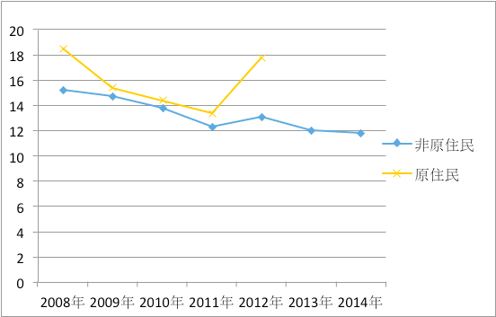
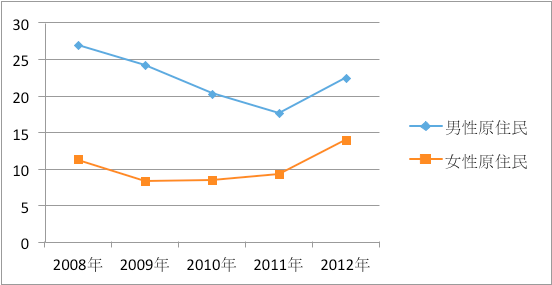

## 第十二條 健康權

《經社文公約》第12條 享有最高水準之身體與心理健康 ICESCR Article 12: The Right to the enjoyment of everyone to the highest attainable standard of physical and mental health

### 影響健康之社會：基本因素Health Inequality

<ol start="241">
  <li>
健康人權之侵害非單純肇因於醫療照護資源不足或分配不均，而是來自於更上游之社會政策規劃失當、經濟安排不公等多重因素所形成之結構性問題，包括物質資源（包括財務、醫療照護設備）、權力（power）、機會（opportunity）等社會決定因素。根據國家報告草稿第二稿提供的資訊，台灣社經條件最弱勢地區與最優勢地區民眾零歲平均餘命差距超過20歲。但從國家報告看來，政府對健康權的實踐仍停留在醫療/物質模式，公共衛生政策仍以醫療補助、醫療設施之建立、醫療服務之提供為主，而忽略健康之社會決定因素（social determinants of health）。
</li>

  <li>
雖然一般國民之醫療照護在全民健康保險之架構下已獲得適當保障，且國家對於城鄉之間醫療資源利用或收費並未設定法律上之差別待遇；但台灣仍存在顯著之健康不平等（health inequality）。尤其是以身心障礙者、原住民族、所得級距、都市化程度、老年人、國籍等身份別加以分組（disaggregate）分析，不同族群仍面臨社會資源與近用醫療照護之差異。國家報告未依人權指標所建議之方式將健康資料分組呈現，以致無法顯示健康不平等的嚴重程度。
</li>
</ol>

### 貿易協定與人權 Trade agreement and human rights

<ol start="243">
  <li>
另一方面，台灣的經濟高度倚賴國際貿易；但台灣政府在評估自由貿易協定（Free Trade Agreement）對社會帶來的利弊時，並未強調貿易協定對群體健康的衝擊。例如，跨太平洋夥伴關係協定（Trans-Pacific Partnership Agreement, 簡稱TPP）對健康人權之衝擊已廣受批評：像是TPP對於智慧財產權採取較WTO「與貿易有關之智慧財產權協定」（Agreement on Trade-related Intellectual Property Rights，TRIPS協定）更為嚴格之保護制度；例如要求各國採取專利連結（patent linkage）制度及延長生物藥品之資料專屬（data exclusivity）期間，可能導致學名藥延遲上市，實質限縮了民眾近用可負擔藥品之能力。
</li>

  <li>
另一個例子，行政院依外國人投資條例第7條之授權訂定之「對國民健康有不利影響而禁止外國人投資之事業別」，遲遲未將菸草製造業列入，導致外國菸商得以輕易依據投資貿易協定至台灣設廠，如監察院第1040800152號報告。
</li>

  <li>
我們敦促政府參酌聯合國食物權特別報告員2011年發布之貿易與投資協定對人權的影響評估指導原則 (Guiding Principles on Human Rights Impact Assessments of Trade and Investment Agreements, A/HRC/19/59/Add.5)，在重大貿易協定與投資協定應進行包含健康權在內之人權影響評估。甚至，在重大行政計畫、政策、法案等等，都應該擇定重要的人權指標，進行以人權為基礎之衝擊評估。
</li>
</ol>

### 原住民族健康問題

<ol start="246">
  <li>
台灣原住民族所面臨健康不均等的現象體現了國家在原住民族政治、經濟制度等面向上對原住民族的偏見及主流社會民族中心主義 (ethnocentrism) 的霸權。以目前台灣官方統計資料可知，原住民族在各年齡層的平均餘命皆少於非原住住民族，而原住民族平均餘命的損失又與國家未落實原住民族權利所造成的結構性暴力 (structural violence) 有密切的關係，原住民族女性健康、高新生兒死亡率、高事故傷害死亡率、酒精濫用、自殺、肺結核、慢性肝炎與肝硬化及代謝性症候群等皆為當今原住民族所面臨之嚴重健康問題。然而，政府部門在策訂原住民族健康政策時，刻意將其「醫療化」 (medicalized)、「一般化」 (generalized) 與「個人化」 (individualized)，造成衛生福利部於2011年依「原住民族基本法」第24條所研擬的 「原住民族健康法草案」遲遲無法進入立法部門進行討論；而新制定的《2025衛生福利政策白皮書》亦取消原載於《2020健康國民白皮書》中之原住民族專章，導致原住民族健康權受到侵害。
</li>

  <li>
政府部門應依世界衛生組織所定義健康權的概念，規劃並建置符合原住民族需求且具文化安全性 (cultural safety) 的醫療系統與生活條件改善措施，同時儘速通過「原住民族健康法」的立法工作，藉此保障原住民族之健康與福祉。
</li>
</ol>

### 普遍醫療體系

<ol start="248">
  <li>
醫護人員工作負擔過重［回應國家報告第238段］

  
政府的統計資料顯示，近年來每萬人口執業人數，無論是醫師、牙醫師、護理師（士）、職能治療師等醫事人員，人數都呈現上升的趨勢。惟近年來醫、護人員紛紛組織團體爭取合理勞動條件，顯示醫療人力資源配置仍待改善，包括台灣護理產業工會等團體一再詬病的「護病比」（nurse-patient ratio）問題。我們認為：

    <ol>
      <li>
衛生福利部應公佈各縣市近五年之醫療資源趨勢，以呈現醫療資源分配之情形；
</li>

      <li>
衛生福利部及健保署應落實合理「護病比」，確保勞動條件及病人權益。根據美國的研究，理想護病比是1:4，歐洲的研究則為1:6。日本目前是1:7。台灣2013年的資料約為1：13，護理人員負擔遠高於前述國家。
</li>
    </ol>
  </li>

  <li>
健保卡鎖卡［回應國家報告第239段］

  
根據健保署的資料，每月大約有80萬人欠繳健保費，其中約77萬人被認定為無能力繳費者。然健保法第37條仍有「拒不繳納之保險對象暫行停止保險給付」之規定，即所謂的「鎖卡」規定。雖然該條已限縮適用範圍，且健保署提供欠費者包括紓困基金貸款、分期繳納等協助。但這些措施往往因資訊不夠暢通，或申請程序繁瑣而無法發揮功能，例如街友、失業勞工，往往以為自己已被鎖卡而不敢就醫。衛福部雖於蔡總統上任一週後宣布，取消欠繳健保費3個月就鎖卡的規定，全台有4.2萬人受惠，但我們認為：

    <ol>
      <li>
尊重1999年1月29日大法官會議釋字第472號解釋，健保鎖卡違憲，對於無力繳納保費者，國家應給予適當之救助，不得逕行拒絕給付。
</li>

      <li>
修法刪除健保法第37條之鎖卡規定，對於所謂「有能力繳納，拒不繳納」之保險對象，以其他工具進行催繳。
</li>
    </ol>
  </li>
</ol>

### 健康不平等Health inequality［回應國家報告第242段］

<ol start="250">
  <li>
國家報告所指出健康不平等的部分仍停留在醫療及照護層次，忽略了收入、財富、勞動條件、社會服務與政治參與機會的分配不均對健康之影響。台灣雖已有健保解決了大多數就醫平等權的問題，但從台灣疾病分佈地圖來看，不平等的問題依舊嚴重。而且《國民健康署年報》缺乏身心障礙者的健康統計或調查數據，在論及身心障礙者健康時僅於疾病治療，未討論如何改善社會環境或社經地位，導致健康不平等的情況持續發生。
</li>

  <li>
我們認為國家應該：

    <ol>
      <li>
加強統計及指標。目前健康權指標（核心文件第32-39點）僅呈現產婦死亡率、嬰兒死亡率、家庭生育率、及國人主要死及疾病死亡率等。這些統計雖可看出大致的公共衛生狀況，卻未明確指出健康不平等的情況。未來應增加標示城鄉之間、不同社經地位之間、以及各種禁止歧視族群之間的健康差距。除此之外，健康權指標不應該只是疾病的統計，應建立台灣完整3A1Q指標。同時，物質成癮及肥胖等問題背後的社會因素也應進一步解釋，避免產生汙名。
</li>

      <li>
提高政府層級。國民健康署雖已公布台灣健康不平等報告書，但卻交由國外團隊撰寫，過程也未開放國內民眾參與，一個企圖消弭不平等的計畫卻未顧及公民參與之原則，反應出政府仍未理解人權的基本原則。此外，消弭健康不平等是跨部會之業務，例如就業及勞動條件、住宅、環境汙染等分別由不同部會主責，因此健康不平等報告書及政策建議應由行政院主導並落實。
</li>
    </ol>
  </li>
</ol>

### 罕見疾病防治及相關醫療照護［回應國家報告第244段］

<ol start="252">
  <li>
2000年制定「罕見疾病防治及藥物法」時，政府並未依法主動提供罕見疾病患者及家庭疾病相關影響之資訊，即使2015年該法第八條修正為：「中央主管機關接獲前條報告或發現具有罕見遺傳疾病缺陷者，經病人或其法定代理人同意，應派遣專業人員訪視，告知相關疾病之影響，並提供病人及家屬心理支持、生育關懷、照護諮詢等服務。」至今已過1年，尚未訂定落實此條文之相關規定。
</li>

  <li>
罕見疾病患者所使用的藥物，在未取得許可證時，可藉由專案申請，獲得全民健保藥品給付，但通過之案件，必須在三年內取得國內藥品許可證，全民健保才得以繼續給付。由於國內臨床試驗資料不足，許可證取得困難。雖《罕見疾病防治及藥物法》已有規定，但中央主管機關（食品藥物管理署、國民健康署）未編列預算鼓勵國內藥品廠商進行臨床試驗與研究，間接影響罕見疾病所需藥品之負擔能力，以及患者之生存權。
</li>
</ol>

### 心理健康［回應國家報告第246-7段］

<ol start="254">
  <li>
街友：心理健康促進之工作，應考量台灣社會的多元性，設計不同的方案。例如，目前雖已有心理健康網計畫，但服務街友的社工指出，許多具有疑似精神障礙的街友並未就醫鑑定，不會有「身心障礙手冊」，也就無法納入社工的追蹤系統。
</li>

  <li>
移工：目前在台移工人數已近六十萬，包括產業及社福外勞，他們離鄉背井、孤立無援，雖有健保身份，但就醫仍多所限制，近來移工自殺事件日增，但移工卻無法近用心理健康之協助。勞動部應主動透過其管理系統，及時協助移工尋求心理健康服務。
</li>

  <li>
原住民族自殺問題：原住民族標準化死亡率顯著高於非原住民族（圖五）；而原住民族中，男性自殺率顯著高於女性（圖六）。非原住民族自殺標準死亡率近幾年似呈逐步下降趨勢，但原住民族健康統計資料目前僅更新到2012年，無法確認是否有類似之下降趨勢。特別是在2012年，因有多位原住民族女性自殺致死，以至於自殺標準率突然驟升。世界各國原住民族因傳統文化與社會結構崩解、社會經濟情況惡劣等等因素，自殺率節節升高，台灣原住民族是否也有類似困境，政府有責任提供資料加以釐清。

    <figure>
      
      <figcaption>圖七 ICESCR 12.1：原住民與非原住民自殺標準死亡率</figcaption>
    </figure>

    <figure>
      
      <figcaption>圖八 ICESCR 12.2：原住民男性與女性自殺標準死亡率</figcaption>
    </figure>

  </li>
</ol>

### 身心障礙者［回應國家報告第243、250-3段］

<ol start="257">
  <li>
國家報告書第243段僅提及老人健康促進計畫及高齡友善健康環境與服務計畫，並沒有提出身心障礙者的健康計劃。由於身心障礙者比一般人較少機會運動和活動，比一般人更易罹患高血壓、高血糖、高血脂三高疾病，不但應建立完整的統計資料，做為健康政策的依據，亦應比照老人友善健康環境與服務計畫。
</li>

  <li>
我國 65 歲以上，需長期照顧者女性較男性多19.6%，80歲以上，需長期照顧者之女性人數較男性人數多62.1%，其中重度失能以上則多74.7%。女性成為障礙者或失能者的機率比男性高，應該給予更多的照顧支持。
</li>

  <li>
醫療服務使用率：身心障礙者利用成人預防保健服務人數僅佔全台身心障礙者總人數15%~16%，比一般成人預防保健服務利用率32%，少了一半。政府未制定身心障礙健康政策與目標，也未有效提升身心障礙者預防保健服務利用率。
</li>

  <li>
醫療機構無障礙設施：依據100年身心障礙者生活狀況及各項需求評估調查顯示，高達99.71%之身心障礙者參加全民健康保險，但無法獨力就醫者占57.27%。總數達20,245家之社區診所並未納入醫院評鑑制度，其設施與服務是否達成無障礙標準難以評估。身心障礙者面臨的障礙包括：

    <ol>
      <li>
物理環境的障礙：社區診所很多有門檻或階梯，使用輪椅者無法就近就診，甚至帶孩子去看病，使用電輪的媽媽進不去，只能在外面觀看。
</li>

      <li>
交通不便：當發生突發狀況，例如急性腸胃炎等急性病症，很難臨時預約復康巴士到大醫院就診，社區診所又無法進入。
</li>

      <li>
醫療設備或設施未符合障礙者需求：例如社區「健檢及抹片檢查車」有階梯，身障婦女無法上車檢查。醫院照X光，醫生護士要求站立，對於重度身障者或脊隨損傷者有困難。
</li>

      <li>
資訊障礙：此外，醫療機構沒有視覺障礙引導設計或人力引導協助，網站沒有無障礙網頁設計供視覺障礙者閱讀，衛教資訊、醫療文件(如：治療說明書、手術同意書…)沒有易讀版及點字版，視覺障礙者、心智障礙者、學習障礙者無法閱讀。
</li>
    </ol>
  </li>

  <li>
障礙女性懷孕分娩過程比一般女性懷孕分娩更為不便，獲得產前的衛教和產後的育嬰資訊常因身體的限制而獲取不易，建議新增助產士到府進行相關衛教及育嬰教育。例如，教準媽媽適當的運動、體重控制、認識懷孕危險徵象、產後護理，以及母乳哺餵方式，其孕婦健康手冊應該設計比一般孕婦更細緻、更多項服務及更友善。對於視障的孕婦應提供語音手冊或檔案適合他們讀取。
</li>

  <li>
特殊需求者口腔整合性照護計畫：身心障礙者總人口數1,148,936人，而特殊需求者口腔整合性照護計畫，主要對象是牙齒治療難度高的特定、重度與極重度身心障礙者（約333,746人）及失能老人。全民健康保險特約牙科醫療院所共6856間，有提供身心障礙服務醫院診所只佔總數14%，多數輕、中度肢體障礙、視覺障礙，因為牙科醫療院所沒有無障礙空間、診療設施及支持服務，仍無法就近使使用口腔照護及治療服務。
</li>
</ol>

### 婦女健康政策［回應國家報告第261段］

<ol start="263">
  <li>
衛福部為促進婦女健康，雖提供多項女性生育健康相關之保健服務，但卻多以「胎兒健康」為主，而非以「婦女健康」為中心。如國健署之孕產婦手冊內容以照顧胎兒為主，未提供產婦生產所可能面臨之現象及風險之相關資訊，也未建立產婦與醫師共同決定之機制，可能造成產婦有過度醫療或暴露於不必要健康風險。而政府除了生育照護及婦癌篩檢外，並沒有意識到醫學上的性別差異對於女性健康的威脅，如心臟病已有大量研究證實男女在臨床表現、治療的差異性。
</li>

  <li>
令人擔心的是，目前台灣有超過半數之鄉鎮無婦產科醫師，且台灣婦產科醫師平均年齡高於醫師平均年齡5歲，至2022年有49%婦產科專科醫師年齡超過60歲。2015年雖通過「生產事故救濟條例」，由政府編列預算分攤生產之風險，然政府面對長期給付過低之現象卻消極以對，恐對婦女之健康權益造成損害。
</li>

  <li>
近五年來台灣未成年女性生育率維持在千分之4，根據2014年的資料顯示，東部地區（花蓮、台東）未成年女性的生育率超過千分之10，其次南投與苗栗縣生育率也達千分之7，明顯呈現城鄉差距。
</li>

  <li>
因此，我們主張政府應提供「以女性為主體」生育照護政策，並強化醫療人員在疾病診斷、處置之性別意識，方能避免女性處於不必要之健康風險中，並呼應國際專家之建議，政府應盡速評估未成年人之性教育政策成效，尤其是在特定地區之未成年女性高生育率應盡速提出對策。
</li>
</ol>

### 傳染病防治

<ol start="267">
  <li>
遊民之人身自由［回應國家報告第262段］：依結核病強制住院隔離治療指引之規定，符合一定條件之結核病患者，除非屬不合作之案例，可解除隔離轉出（出院）；但對於遊民，不論其服藥型態，卻一律要求應繼續住院治療至完治，可能過度限制其人身自由。
</li>

  <li>
憲法法院於釋字第690號中對於傳染病防治法所定「必要之處置」（包含強制隔離）之法院救濟等程序，認為應儘速通盤檢討；提審法通過後，衛生主管機關執行各類隔離或檢疫措施時，亦可能因涉及限制傳染病病人、接觸者或疑似被傳染者之人身自由，而落入提審法範疇 。但傳染病防治法並未為相對應之修正，導致實務操作上對特定措施（如居家隔離、檢疫）是否適用提審相關規定出現爭議。
</li>

  <li>
愛滋病污名化與歧視層出不窮：

    <ol>
      <li>
愛滋污名導致篩檢率低：血液檢驗是確認個人是否感染愛滋病毒的唯一方式，國家應該提供友善、隱密、有效、便利的篩檢服務，排除並減低愛滋污名，達到鼓勵民眾主動篩檢的效果。然而，我國愛滋篩檢率約75%，低於美國的87%與聯合國提出的90%篩檢率目標。我國愛滋篩檢率偏低的原因，除了民眾缺乏自主篩檢意識，最主要是污名壓力的影響。另外，我國長期以來側重特定族群的篩檢策略，造成民眾的認知偏差，認為不是同志、沒有肛交或沒有多重伴侶就不會感染，甚至民間至今仍然流傳愛滋是「骯髒病」、「垃圾病」的說法。
</li>

      <li>
不當通報，導致感染者被退學：台灣的國家政策認定愛滋是法定傳染病，感染者需要被追蹤管理；但通報系統未能保障愛滋感染者的隱私，導致一名國防大學學生遭受退學處分。退學前在學校遭受歧視待遇，包括被禁止參加游泳課，不得與他人共用餐具，衣物被要求分開洗滌，也暴露出該校師長、教官衛生教育知識嚴重不足
</li>

      <li>
愛滋感染者隱私保護與醫療人權：法令規定感染者就醫時應主動揭露感染身份，卻無法禁止醫護人員的轉診安排或拒診。此外，愛滋一般化已經成為共識，但其實際操作卻不夠細膩，例如：近年健保署積極推動雲端藥歷等醫療資訊電子化，反而使得感染者諱忌就醫；或是矯正機關在釋放收容人之前，對家屬與在地警政機關的通知，明載收容人為愛滋感染者，造成出監人受家屬遺棄，都是因為對於「愛滋一般化」之認知有所差異。使愛滋一般化確實是去污名的長期目標，但需要以人權標準全盤檢討後，規劃、重建項目，與各團體對話，才能避免犧牲感染者之權益。
</li>
    </ol>
  </li>
</ol>

### RCA案後續醫療［回應國家報告第270段］

<ol start="270">
  <li>
RCA（Radio Corporation of America美國無線電公司）公司因使用有機溶劑，造成上千名員工罹患癌症，公害職災集體訴訟前後經過數十年，2015年4月17日台北地方法院一審宣判RCA前員工勝訴，被告RCA、Thompson等公司共應賠償前員工新台幣5億6645萬元。
</li>

  <li>
勞動部雖於一審判決後新訂定公布「勞動部辦理原臺灣美國無線電股份有限公司罹病死亡勞工之慰問金發放要點」，惟發放條件非常嚴苛，除只侷限於桃園廠的勞工外，還侷限於台北地方法院一審判決所載內容，發放範圍僅限特定癌症死亡家屬。2015年10月23日RCA員工關懷協會及工傷協會提出訴求：

    <ol>
      <li>
勞動部應依全台灣RCA工人實際受害狀況，從寬認定、全面給付，徹底檢討台灣職業病認定與給付制度。
</li>

      <li>
「慰問金」應依職災勞工保護法立法精神，不應設立門檻，政府代位求償。
</li>

      <li>
勞動部應公布本案實際給付總額，並受職災勞工與社會大眾監督。
</li>
    </ol>
  </li>
</ol>

### 物質濫用［回應國家報告第271-3段］

<ol start="272">
  <li>
有關藥物或酒精成癮，關注的不只是後端刑法懲罰及強制就醫，更應該關注前端成癮者社經地位與家庭弱勢處境。目前國內提供藥物或酒精成癮者的服務仍有待加強，例如：全民健康保險給付項目包括酒癮、藥癮所引起之併發症狀，但戒酒癮、戒藥癮是不給付之項目，因此藥癮者及酒癮者（未出現精神病症狀者）需全額自付約2-3萬斷戒療程費用，對於經濟弱勢的個人或家庭，恐無法負擔，中央編列預算僅提供各縣市執行「酒癮戒治處遇服務方案」，建議將酒癮、藥癮斷戒與治療納入全民健康保險給付。
</li>

  <li>
個人戒治若無法獲得家庭及社會支持，復發率很高。應該要投注更多資源強化社區照護服務，建立成癮者個案處遇管理服務模式（心理、家庭、社會適應、就業轉介…等）。
</li>

  <li>
成癮者的精神疾病與其他的精神障礙者，情況並不相同，媒體報導及相關單位對社會說明時，應該有明確的區別，避免造成民眾混淆，而影響領有身心障礙證明的精神障礙者，在社區生活、社區復健服務遭受排擠與拒絕。為避免汙名化，提高成癮者求助或治療意願，促使成癮者回歸正常生活，建議加強相關單位合作（警政、衛政、社政、教育、勞政）建構社會安全網，加強社區民眾正向心理衛生教育與資源管道宣傳。
</li>
</ol>

### 職場健康［回應國家報告第275-6段］

<ol start="275">
  <li>
我國職業傷病的舉證責任在勞工及醫師，除了立即產生健康效應之職災，如機械切割、跌傷、車禍等較易確認，若是慢性健康危害、潛伏期長的職業病，雇主經常否認其工作相關性，且台灣的職業病認定指引相對嚴格，採保守認定，以致台灣職業病的補償率遠低於國際標準，約為歐盟國家的1/10-1/50。
</li>

  <li>
以石綿為例，有高達98%的男性間皮瘤（mesothelioma）可歸因於石綿暴露。根據全國癌症登記資料庫，台灣在2010年一年中，就有73個惡性間皮瘤個案。但根據勞保局的職業病給付資料，石綿肺症及其併發症案例數每年大都不超過5例；職業性癌症並未區分類型，總件數每年平均不到10例。而德國在2012年職災保險即補償了3626件石綿疾病、日本在2013年由勞災保險補償了1084件石綿相關職業病。過去台灣在石綿使用上非常普遍，相較他國統計，顯示台灣在石綿相關職業病被嚴重低估。
</li>

  <li>
對於日益嚴重的職場疲勞問題，在職業病認定上，不僅認定嚴格，且一直以心血管疾病為主，容易排除這類疾病風險較低的族群（如停經前的女性、年輕族群），而且忽略了慢性疾病，如高血壓、代謝症候群、肌肉骨骼疾病、免疫系統疾病、生殖系統疾病等，以及焦慮、憂鬱等身心症。勞動檢查也以工時為負荷過重的依據，忽略職業疲勞問題來源還有「職場社會心理危害」，包括不當的勞動政策、威權式的管理模式，以及不對等的勞雇關係。政府所推動的職場健康促進計畫，也只聚焦於個人行為，如運動、減重、飲食等，而忽視了社會致病因素。國家應檢討不當勞動政策，如彈性化的人力聘僱，以及調查組織層面的工作壓力源，如不穩定的僱用型態、薪資型態（如浮動薪資）、職場正義等。同時，國家應檢討工時規範並具體落實、強化職場社會心理危害管理與強化組織層面的職場健康調查等。
</li>

  <li>
在職業健康管理上，依法勞工有接受定期健康檢查之義務，雇主有負擔費用的義務。根據2013年勞動部調查，半數以上受僱者未曾接受勞工健康檢查，礦業及土石採取業、營造業沒有定期健康檢查的勞工超過7成。對於從事「勞工健康保護規則」所列27類特別危害健康作業之勞保被保險人，可以進行預防職業病健康檢查。但此機制僅限於在保員工，對於退休者並無追蹤管理，無法有效預防潛伏期較長之疾病。
</li>
</ol>

### 風力機噪音控制［回應國家報告第278-9段］

<ol start="279">
  <li>
現行的法規不足以保障風機周圍居民的健康權。根據WHO的研究，風機渦輪產生的噪音，超過32分貝就會影響居民的睡眠。民間團體在2014年就已經參考WHO的研究與各國規範，提出「再生能源發電設備設置管理辦法」的修正草案，建議對住宅、醫院、學校、其他公共建築物等，訂定合理之舒適距離，然而政府迄今仍未開始修法保障民眾的健康權。
</li>

  <li>
能源局所召開的實驗性聽證會，完全不具《行政程序法》所訂定之行政聽證的法律效力。且自2013年至今，政府從未就風力機設置適當距離的規範進行任何具法律效力的正式聽證程序，忽視公民參與政府決策的權利。當前台灣西部沿海仍有許多風力機離居民住宅非常近（甚至不到100公尺），政府的不作為，即是持續對沿海居民健康權的侵害。
</li>
</ol>
